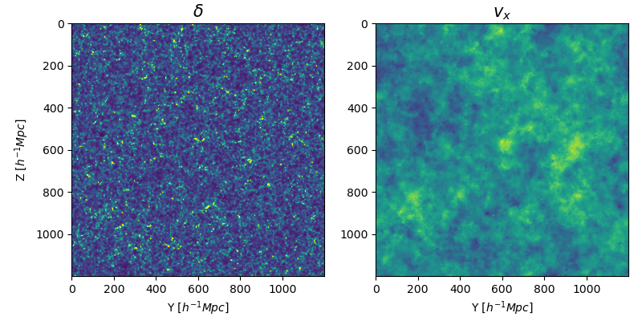

# Python-wrapped Delaunay Tessellation Field Interpolation

## Introduction

In this project, we offer a user-friendly Python implementation of the **Delaunay Tessellation Field Interpolation (DTFE)** method. The source code has been rewritten from the publicly available C++ [DTFE](https://github.com/MariusCautun/DTFE/) code, with functions wrapped using `Pybind11``. This allows users to easily access the DTFE method in Python while maintaining the high efficiency of C++."

### Feature
* DTFE interpolation of the particle density & velocity on the uniform grid for 3D/2D simulation box.
* DTFE interpolation of any 3D scalar field.
* Interpolation on arbitrary sampling points.
* High efficiency with C++ backend and easy coding with Python language.

The tool is currently under development, and additional practical features, such as power spectrum calculation, will be added in the near future.

## Compilation
To use this tool, the C++ codes and its dependencies have to be previously installed and compiled. 

The wrapper `Pybind11` is header-only library, but the rest of libraries should be pre-compiled. Modify the bash file [compile.sh](./compile.sh) and make sure that you have loaded the necessary environments before run it. 

* [CMake](https://cmake.org/)
* [Boost library](https://www.boost.org/)
* [CGAL](https://www.cgal.org/)
* [Pybind11](https://github.com/pybind/pybind11)


## Start

To compile and install the source file.
```bash
bash compile.sh
```

Here is quick example of usage. 

```python
import numpy as np
import sys
sys.path.append("/path/to/pyDTFE/location")
from pyDTFE import DTFE_3D

L = 60          # Mpc/h
N = 100
pos = np.fromfile( DATA_PATH_POS, dtype="float32" )  # shape(Nparticles, 3)
vel = np.fromfile( DATA_PATH_VEL, dtype="float32" )  # shape(Nparticles, 3)
dtfe = DTFE_3D( pos, L=L, Nmesh=N)
results = dtfe.GridVel(vel)
dens = results[0 ]    # shape(N, N, N)
velo = results[1:]    # shape(3, N, N, N)
```

Below shows the result (note that the number density in this quick example is low, which may cause it to appear noisy).

```python
fig, axes = plt.subplots( 1, 2, dpi=100, figsize=(8, 4) )
axes[0].imshow( dens[2] /np.mean(dens) -1 , vmin=-1, vmax=3, )
axes[1].imshow( velo[0][2]  )
axes[0].set_title(r"$\delta$", fontsize=15 )
axes[1].set_title(r"$v_x$", fontsize=15 )
plt.tight_layout()
plt.show()
```
